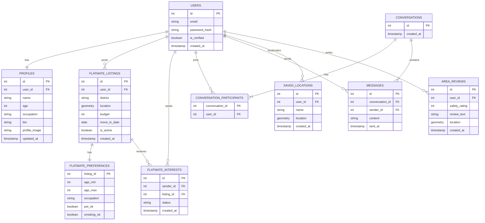
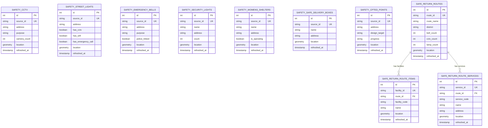

# Entity Relationship Diagram

## Platform Tables

---

## Safety Data Tables

---

## Key Types

| Key  | Meaning                           |
| ---- | --------------------------------- |
| `PK` | Primary key                       |
| `FK` | Foreign key                       |
| `UK` | Unique key - used for ETL upserts |

## Notes

- `geometry` = PostGIS Point for all tables except `SAFE_RETURN_ROUTES` which uses LineString
- Safety tables have no FK relationships between each other - independent government datasets
- `route_id` on items and services tables is a logical FK only, not enforced by the database
